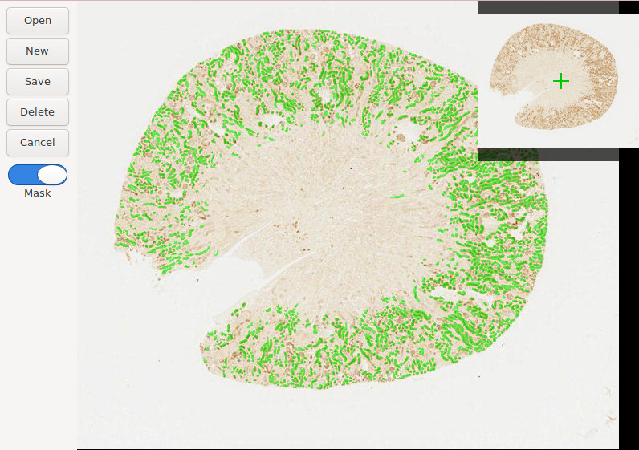
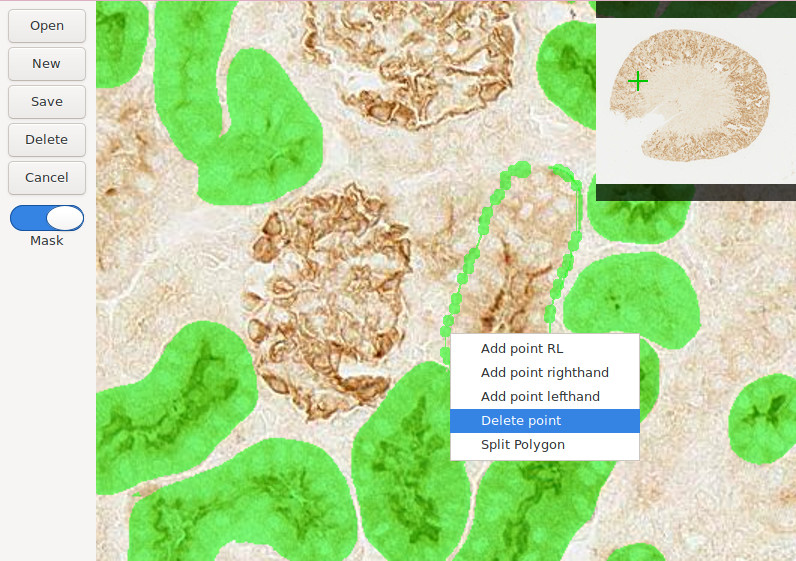

## Labelwsi

Labelwsi is a Whole Slide Image annotation tool inspired by
<https://github.com/wkentaro/labelme>. It can create new annotations, as well
as edit masks generated by ML inferences.

It is written in Python and uses GTK3 for gui. In order to navigate large slide
efficiently, deepzoom tiles are generated on the fly and cached in sqlite
database. Currently it works with Aperio svs, Leica scn, Zeiss czi, and pyramid
tiff format. With minor modifications, it should be able to work with any whole
slide image format supported by Openslide.


<div align="center">
    
</div>

<div align="center">
    
</div>


## Requirements

- Linux
- Python3
- Openslide
- gtk3
- opencv


## Installation

The prefered installation method is using anaconda:

```bash
conda create --name labelwsi python=3.9
conda activate labelwsi
conda install -c conda-forge scikit-image=0.19.2
conda install -c conda-forge opencv=4.5
conda install -c conda-forge gtk3=3.24
conda install -c conda-forge pygobject=3.42
conda install -c conda-forge openslide
conda install -c conda-forge openslide-python=1.2
conda install -c conda-forge pycocotools=2.0.4

```

Openslide has issue with libpixman 0.38, which comes with latest anaconda. An
ealier version, such as version 0.36 is required. Find libpixman-1.so.0.38.0 in
conda environment directory,e.g. ~/.conda/envs/labelwsi/lib and replace it with
an ealier version.


## Usage

It has two modes.

The first mode works on whole slide. Run `labelwsi path_to_whole_slide_image`.
If it is the first time open a whole slide image, a sqlite database with same
filename will be created for storing annotation masks, polygons and tile
caches.

The second mode uses Meta AI's Segment Anything.

- Right click in an empty area, then select "Add SAM points" to enter SAM mode.

- Left-click on the object of interest to add hint points or prompts in SAM's
terms.

- Click the "SAM it" button on the left pane or press Enter to trigger SAM. The
SAM model will return up to 3 candidate masks. Use the left and right arrow
keys to switch between them. Click the "Save" button on the left pane or press
Enter again to save the mask.

Please note that SAM mode processes the entire image, so it's not practical for
using on large images. It's recommended to use SAM mode only on small images,
such as a 1333x800 pixels image in the training dataset. SAM mode is disabled
if image is larger than 1500x1500.

While SAM mode requires GPU, it can still run on CPU, although loading image
may take longer.


## Keyboard shortcuts

In SAM mode, `Left` and `Right` key iterate over three highest scored SAM
proposed masks; `Return` accept a proposal; `Esc` to cancel SAM proposals.

In mask edit mode, press `x` to delete the polygon point under mouse cursor.


## Converting an image file to pyramid tiff format

LabelWSI expects whole slide format. Use `vips` to convert a regular image file
to a pyramid tiff format, which is a valid format recognized by Openslide.

```
vips tiffsave nopyramid_input_image_file output_pyramid_image_file \
    --tile --pyramid --compression jpeg --tile-width 512 --tile-height 512
```

It will convert the image file to the desired pyramid tiff format, enabling it
to be used with LabelWSI.


